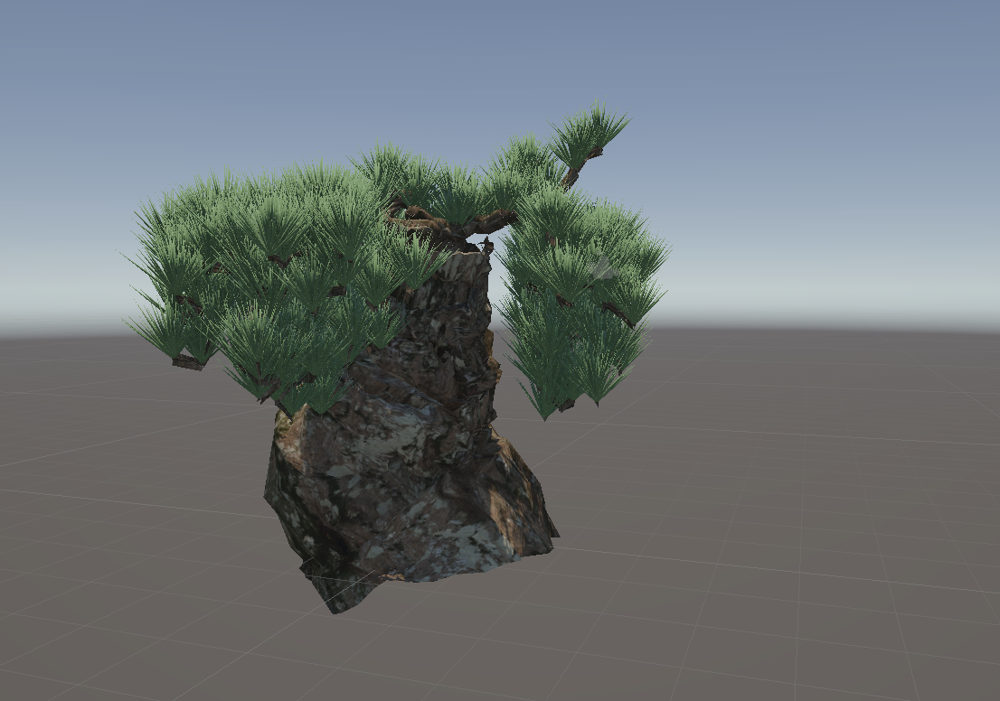
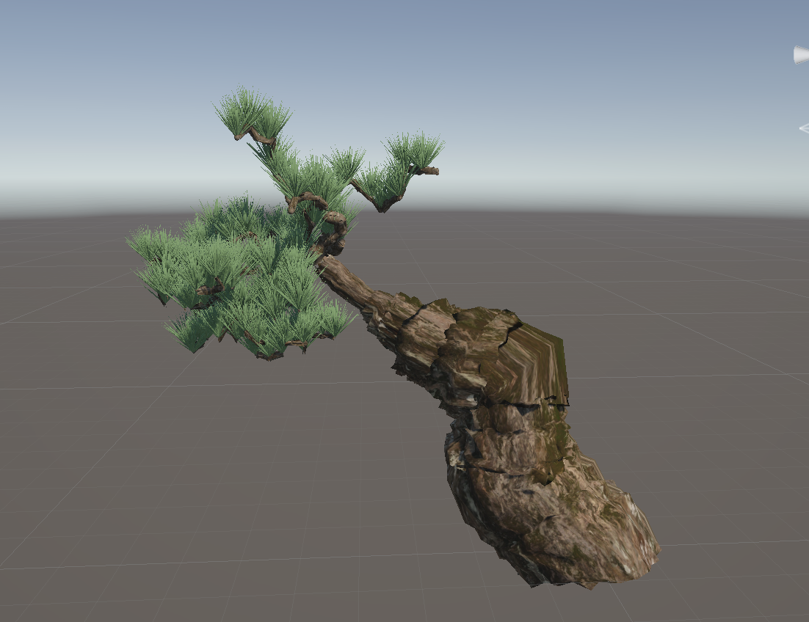
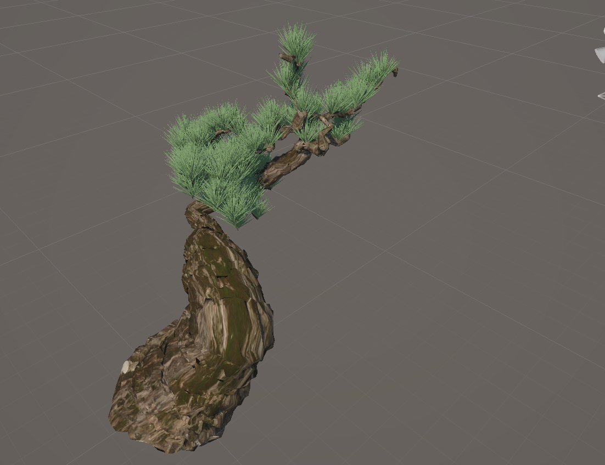
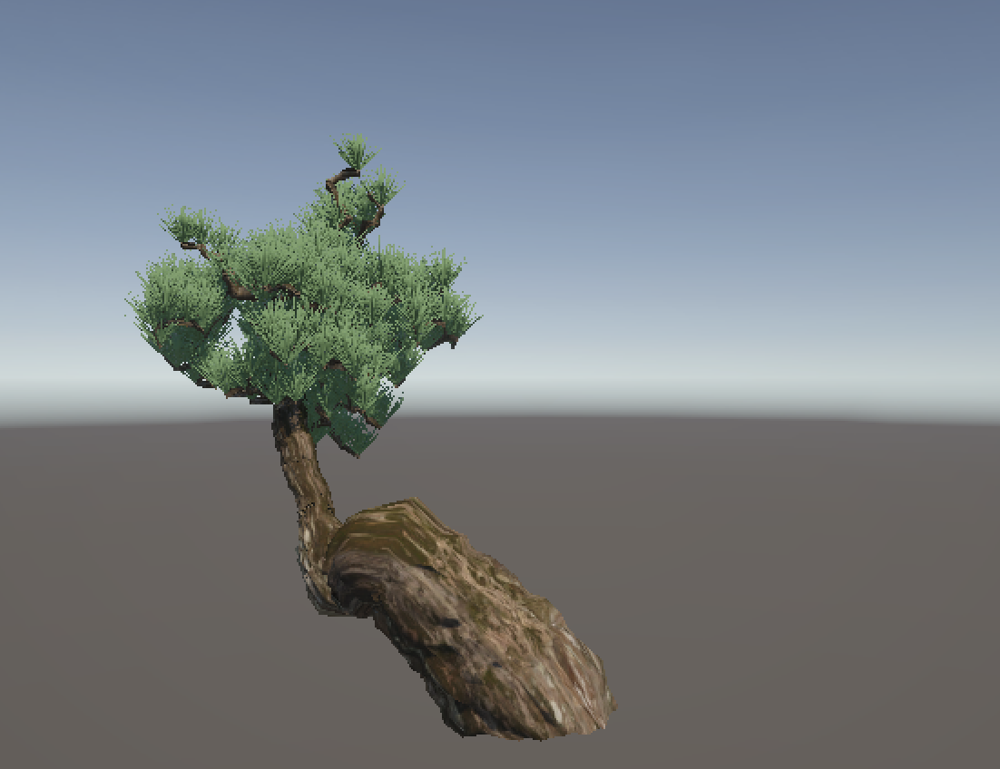
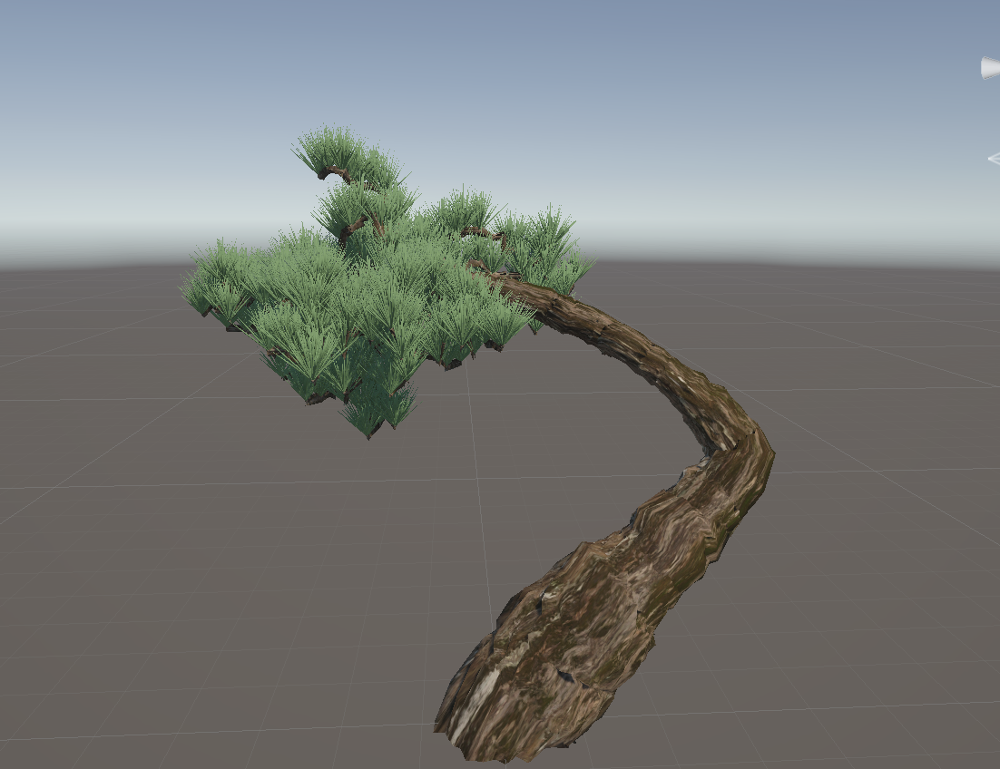
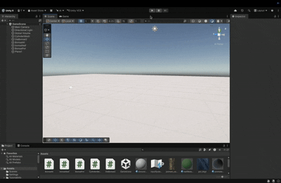
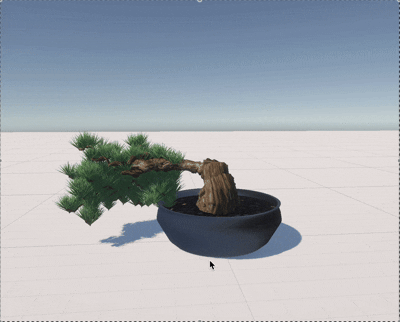

# Procedural Bonsai Generator（プロシージャル盆栽生成）
<p align="center">

</p>

## 概要

Unityで制作したプロシージャル盆栽生成システムです。

幹・枝・葉をアルゴリズムによって自動生成し、
毎回異なる盆栽モデルを生成できます。

本作品ではメッシュ生成を一から実装し、
Unity標準モデルを用いずに3Dモデルを構築しています。
1週間で１人で作り上げた作品です。
<!--  -->

---

## 制作背景

　日本の伝統文化である盆栽をコンピュータグラフィックスで表現することを目的として、本作品を制作した。
　樹木は非常に複雑な形状を持つため、手作業でモデリングするのではなく、アルゴリズムによって自然な樹形を自動生成することを目指した。
　盆栽は人工的に育成される一方で、左右非対称で自然な美しさを持つことが特徴である。この特徴は、ランダム性を取り入れた生成アルゴリズムとの親和性が高いと考え、ランダムな初期値から盆栽を生成するアルゴリズムを開発した。
　本アルゴリズムでは、ランダムな初期値をもとに樹形を生成するため、同じ盆栽が再び生成されることはない。また、生成アルゴリズムに高い自由度を持たせることで、多様な形状の盆栽を生み出すことができる。そのため、どのような盆栽が生成されるかは事前に予測できず、予想外に趣のある樹形が現れるという偶然性も、本作品の魅力の一つである。
　さらに、盆栽モデルは実行後わずか数秒で生成されるため、何度でも新しい作品を生成し、その中からお気に入りの一本を見つける楽しみを体験できる。

---


## 主な実装内容

- 幹のプロシージャルメッシュ生成
- 円柱メッシュをパスに沿って生成
- 樹皮の凹凸生成
- DLA（Diffusion Limited Aggregation）を用いた枝生成アルゴリズム
- 葉メッシュの自動生成
- メッシュ法線・UVの生成
- ランダム性を利用した自然形状の生成
---

## 使用技術

- Unity 6
- C#
- Procedural Mesh Generation
- Mesh API
- Diffusion Limited Aggregation (DLA)
- Random Walk
- Vector Mathematics
- UV Mapping

---

## 工夫した点

- 幹のパスを空間に配置した障害物を回避するように作成
- パス方向から局所座標系を計算し、幹が自然に曲がるようにした
- 樹皮表面にノイズを加え、凹凸を表現
- 独自に改良したDLAによる枝生成で自然な枝分かれを再現
- 円柱と円錐を組み合わせた松葉メッシュを自動生成
- 毎回異なる盆栽が生成されるよう乱数を利用
---

## 今後の予定
本作品は、Unityおよびプロシージャルモデリングの理解を深めることを目的として、自身の興味のあるテーマである「盆栽」を題材に制作しました。

今後は、単なる3Dモデル生成に留まらず、より実用的で魅力的な作品へ発展させたいと考えています。具体的には、生成したモデルを3Dプリンターで出力し、物理的な盆栽作品として鑑賞できるようにすることや、アプリケーションとしてユーザーが盆栽を育成・編集・鑑賞できる機能を追加することを検討しています。また、XR空間上で生成した盆栽を配置・鑑賞し、現実空間と融合した新しい鑑賞体験を提供できるシステムへの発展も目指しています。

---

## 実行方法

Unityでプロジェクトを開き、

```
GameScene
```

を実行してください。

---

## 実行結果

<p align="center">
  
  
</p>

<p align="center">
  
  
</p>
<p align="center">
  
  
</p>

# デモ

<p align="center">

</p>

<p align="center">

</p>

---

## 作者

富吉 涼太
