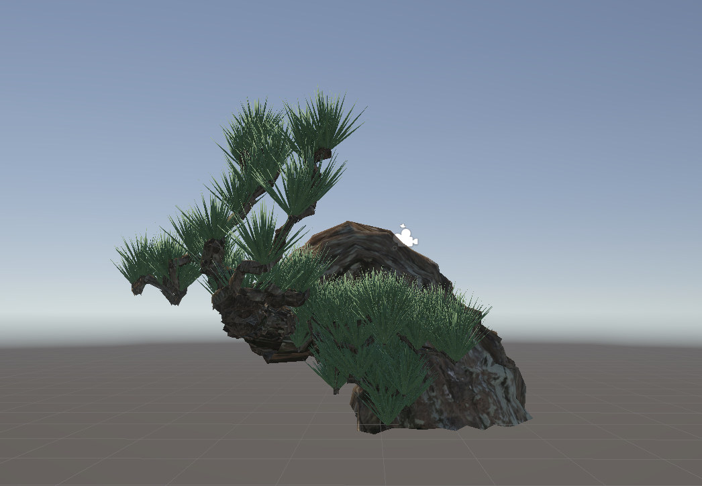

# Procedural Bonsai Generator（プロシージャル盆栽生成）
<p align="center">

</p>
## 概要

Unityで制作したプロシージャル盆栽生成システムです。

幹・枝・葉をアルゴリズムによって自動生成し、
毎回異なる盆栽モデルを生成できます。

本作品ではメッシュ生成を一から実装し、
Unity標準モデルを用いずに3Dモデルを構築しています。


---

## 制作背景

日本文化である盆栽をコンピュータグラフィックスで表現したいと考え、本作品を制作しました。

樹木は非常に複雑な形状を持つため、手作業ではなくアルゴリズムによって自然な形状をランダムに生成することを目標としています。

---


## 主な実装内容

- 幹のプロシージャルメッシュ生成
- 円柱メッシュをパスに沿って生成
- 樹皮の凹凸生成
- DLA（Diffusion Limited Aggregation）を用いた枝生成アルゴリズム
- 松葉メッシュの自動生成
- メッシュ法線・UVの生成
- ランダム性を利用した自然形状の生成
---

## 使用技術

- Unity 6
- C#
- Procedural Mesh Generation
- Mesh API
- Diffusion Limited Aggregation (DLA)
- Random Walk
- Vector Mathematics
- UV Mapping

---

## 工夫した点

- パス方向から局所座標系を計算し、幹が自然に曲がるようにした
- 樹皮表面にノイズを加え、凹凸を表現した
- DLAによる枝生成で自然な枝分かれを再現した
- 円柱と円錐を組み合わせた松葉メッシュを自動生成した
- 毎回異なる盆栽が生成されるよう乱数を利用した
---

## 今後の予定
本作品は、Unityおよびプロシージャルモデリングの理解を深めることを目的として、自身の興味のあるテーマである「盆栽」を題材に制作しました。

今後は、単なる3Dモデル生成に留まらず、より実用的で魅力的な作品へ発展させたいと考えています。具体的には、生成したモデルを3Dプリンターで出力し、物理的な盆栽作品として鑑賞できるようにすることや、アプリケーションとしてユーザーが盆栽を育成・編集・鑑賞できる機能を追加することを検討しています。また、XR空間上で生成した盆栽を配置・鑑賞し、現実空間と融合した新しい鑑賞体験を提供できるシステムへの発展も目指しています。

---

## 実行方法

Unityでプロジェクトを開き、

```
GameScene
```

を実行してください。

---

## 実行結果

<p align="center">
  
  
  
</p>

<p align="center">
  
  
  
</p>
<!-- <p align="center">
  
  
  
</p> -->

# デモ

<p align="center">

</p>

---

## 作者

富吉 涼太
